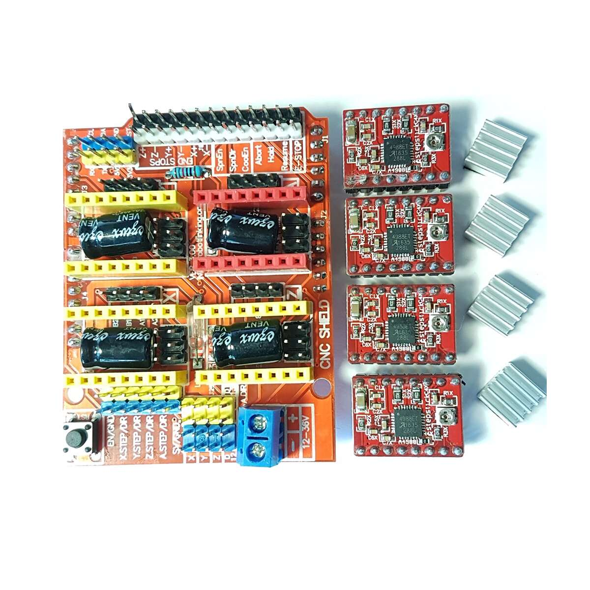
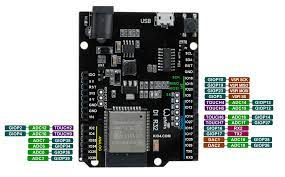
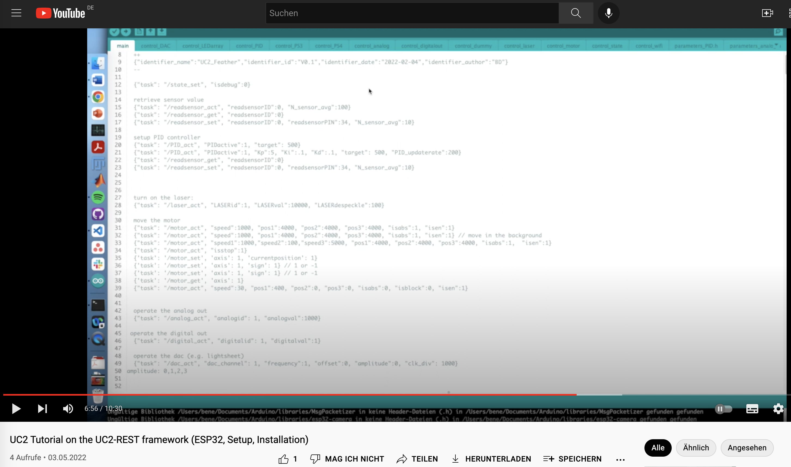
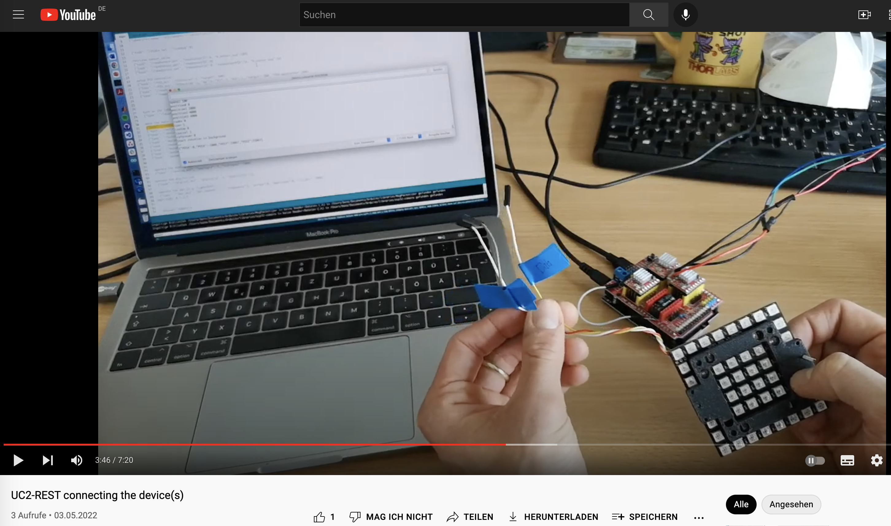
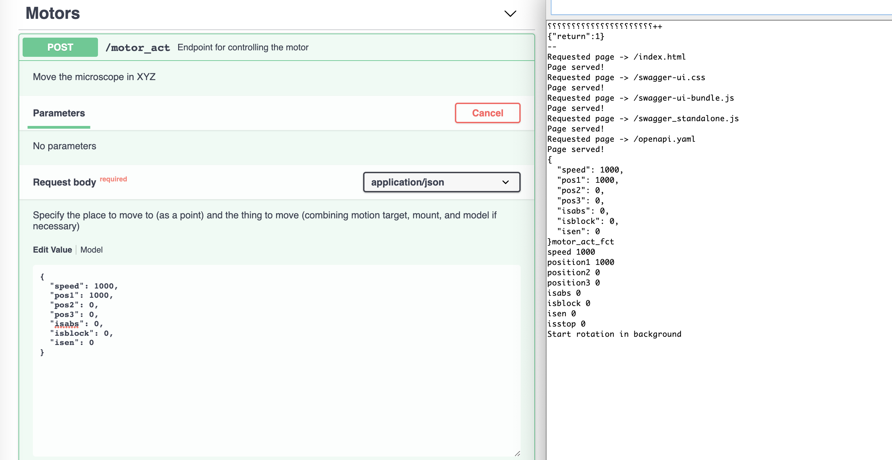

<p align="left">
<a href="#logo" name="logo"></a>
</p>

# UC2 REST API

This is the playground to start development of using UC2 modules using the HTTP REST API.

## ESP32

This folder contains all the code for handling actuators and sensors through HTTP requests.
Please use the release versio of the Arduino code and flash it on your ESP32 wemos D1 R32. You can find the [RELEASE here](https://github.com/openUC2/UC2-REST/releases/tag/ESP32_WEMOS_D1_R32)

## PYTHON

We provide a simple [ESP32Client.py](./PYTHON/ESP32Client.py) that can be used to control the ESP32 microcontroler. We have a Jupyter-notebook based tutorial that can help you through the process.

In order to run it, clone this repository/download it and do:
```
conda activate $YOURENVIRONMENT$
cd PYTHON
jupyter notebook
pip install numpy requests python-opencv
pip install socket tempfile pyserial
```

The tutorial can be found [here](./PYTHON/UC2_REST_Tutorial_v0.ipynb).

You can also install it using `PIP`:

```
!pip install UC2-REST==0.1.0rc0
```


### General Usage

```py
from ESP32Client import ESP32Client  
ESP32 = ESP32Client(serialport="unknown")

# move and measure
print("Current position: "+ str(ESP32.get_position(axis=1)))
ESP32.move_x(steps=1000, speed=1000, is_blocking=True, is_absolute=True, is_enabled=True)

# set a funny pattern
import numpy as np

Nx=8
Ny=8
led_pattern = np.abs(np.int8(np.random.randn(3,Nx*Ny)*255))
ESP32.send_LEDMatrix_array(led_pattern, timeout=1)
```

## Hardware

It is the easiest to use the ESP32 WEMOS D1 R32 (Arduino compatible) board in combination with the CNC shield v3:

<p align="center">
<a href="#logo" name="logo"></a>
</p>

<p align="center">
<a href="#logo" name="logo"></a>
</p>


## Tutorials

We provide two tutorials that help you installing the software:

<p align="left">
<a href="https://youtu.be/9doTdo5SW2E" name="logo"></a>
</p>


as well as connecting the hardware:

<p align="left">
<a href="https://youtu.be/v8Xx2iVbDck" name="logo"></a>
</p>


# Installation

***IMPORTANT: USE THE ESP-IDF version 1.0.6 - >=2.0 has issues with the PS3 controller!***

### Install Arduino IDE

- Download the Arduino IDE 1.8.1 from [here](https://www.arduino.cc/en/software/OldSoftwareReleases)
- Install it

### Install Serial driver

In case you use a chinese derivate Arduino or an ESP32 board, you most likely need to install the ***CH340*** serial driver. Please have a look [here](https://learn.sparkfun.com/tutorials/how-to-install-ch340-drivers/all)

### Get the right Boards

If you want an ESP32 board, please add the following sources to the preferences (Boards). More information can be found [here](https://randomnerdtutorials.com/installing-the-esp32-board-in-arduino-ide-windows-instructions/)

```
https://dl.espressif.com/dl/package_esp32_index.json, http://arduino.esp8266.com/stable/package_esp8266com_index.json
```

### Install the required libraries


***BEST PRACTICE:*** Clone the following repository and copy the libraries inside the Arduino library folder: [https://github.com/beniroquai/BenesArduinoLibraries](https://github.com/beniroquai/BenesArduinoLibraries)

*Alternatively:*

Go to Tools -> Manage Libraries and add the following libraries (More information [here](https://arduinogetstarted.com/faq/how-to-install-library-on-arduino-ide):

```
ArduinoJson (Benoit Blanchon)
StepperDriver (by Laurentiu Badea)
Adafruit NeoMatrix (Adafruit) and its dependency
```


### PS3/PS4 controller

This code enables a rudimentary integration of the PS3/PS4 controller. For this you need to know/modify the controller's MAC address.

Add the corresponding libraries from here:
- [PS3 controller](https://github.com/jvpernis/esp32-ps3) from the Arduino library manager
- [PS4 controller (modified)](https://github.com/beniroquai/PS4-esp32/)

Please follow the tutorial [here](https://github.com/aed3/PS4-esp32/edit/master/README.md) (similar for PS3)

#### Installation
The instructions on how to do this are base off what can be found [here](https://github.com/jvpernis/esp32-ps3/issues/3#issuecomment-517141523)
1. You can add the ESP32 boards to your Arduino IDE by adding them to the Boards Manager:
    1. Open `File -> Preferences`
    1. Paste the following URL in the `Additional Boards Manager URLs` field:
    `https://dl.espressif.com/dl/package_esp32_index.json`
    1. Open the Boards Manager with `Tools -> Board: "xxx" -> Boards Manager`
    1. Look for `esp32` (probably the last one in the list), and click `install`
    1. Select the ESP32 board you have with `Tools -> Board: "xxx"` under the section `ESP32 Arduino`
1. To install this library into your Arduino IDE:
    1. Click on the "Code" button in the top right of this page
    1. Select "Download Zip" (It's always a good idea to look through the code on this page first to make sure you know what you're downloading)
    1. In the Arduino IDE, navigate to `Sketch -> Include Library -> Add .ZIP Library`, then select the file you just downloaded

### Pairing the PS4 Controller:

When a PS4 controller is 'paired' to a PS4 console, it just means that it has stored the console's Bluetooth MAC address, which is the only device the controller will connect to. Usually, this pairing happens when you connect the controller to the PS4 console using a USB cable, and press the PS button. This initiates writing the console's MAC address to the controller.

Therefore, if you want to connect your PS4 controller to the ESP32, you either need to figure out what the Bluetooth MAC address of your PS4 console is and set the ESP32's address to it, or change the MAC address stored in the PS4 controller.

Whichever path you choose, you might want a tool to read and/or write the currently paired MAC address from the PS4 controller. You can try using [sixaxispairer](https://github.com/user-none/sixaxispairer) for this purpose.

If you opted to change the ESP32's MAC address, you'll need to include the ip address in the ```PS4.begin()``` function during within the ```setup()``` Arduino function like below where ```1a:2b:3c:01:01:01``` is the MAC address (**note that MAC address must be unicast**):

```
void setup()
{
    PS4.begin("1a:2b:3c:01:01:01");
    Serial.println("Ready.");
}
```


### Compile and Upload Arduino Firmware

- Download this repository following this [link](https://github.com/openUC2/UC2-REST/archive/refs/heads/master.zip)
- Go to the folder that contains the file `main.ino` in [.ESP32/main](https://github.com/openUC2/UC2-REST/tree/master/ESP32/main)
- Select the board you want to install it to (e.g. Arduino or ESP32 from the Boardmanager)
- *Optional* adapt some settings (e.g. adding modules, selecting the communication channel like Wifi / Serial) by commenting/outcommenting the following lines (you can find it under the tab
*REST_API_JSON_Serial_Wifi_motor_PS3_v0* )


```
 // CASES:
// 1 Arduino -> Serial only
// 2 ESP32 -> Serial only
// 3 ESP32 -> Wifi only
// 4 ESP32 -> Wifi + Serial ?

// load configuration
#define ARDUINO_SERIAL
//#define ESP32_SERIAL
//#define ESP32_WIFI
//#define ESP32_SERIAL_WIFI

....


// load modules
# ifdef IS_ESP32
#define IS_DAC // ESP32-only
#define IS_PS3 // ESP32-only
#define IS_ANALOGOUT// ESP32-only
#endif
#define IS_LASER
#define IS_MOTOR

```
- *Optional*: Adapt some pin settings in thhe file `pindef.h`
- Now select the port of your arduino device. go to `tools`-> `Ports` and select the one that looks like your arduino/esp32
- Now upload the code (hit the right-arrow on the left hand side)
- Compiling can take a moment


### Test the code using the Arduino Serial

- Open the Arduino Serial (more information [here](https://starthardware.org/arduino-serial-print/)
- Set the Baudrate to `115200` and enter some `Json` commands to manipulate the actuators
  - Identify the Board: `{"task": "/state_get"}`
  - Turn on the laser: `{"task": "/laser_act", "LASERid":1, "LASERval":2}`
  - Move the motor: `{"task": "/motor_act", "axis":1, "speed":1000, "position":1000, "isabsolute":1, "isblocking":1}`
  - Operate the analog out: `{"task": "/analogout_act", "analogoutid": 1, "analogoutval":1000}`
  - Operate the dac (e.g. lightsheet): `{"task": "/dac_act", "dac_channel": 19, "frequency":1, "offset":0, "amplitude":0, "clk_div": 10000}`


### Test the code using the Python interface

- Open a terminal in the folder where you downloaded this repository
- Navigate to the folder [PYTHON](https://github.com/openUC2/UC2-REST/tree/master/PYTHON)
- Install the following dependencies via `pip`:
```pip install requests python-opencv```
- Open the file [TEST_ESP32RestSerialAPI.py](https://github.com/openUC2/UC2-REST/blob/master/PYTHON/TEST_ESP32RestSerialAPI.py)
- Adapt the `serialport`:
```
serialport = "/dev/cu.SLAB_USBtoUART"
serialport = "/dev/cu.SLAB_USBtoUART"
serialport = "/dev/cu.wchusbserial1430"
serialport = "COM3"
```
- Execute script in Python and check result
- In case of an error, file an Issue here


## UC2 and ImSwitch

The device adapter in [PYTHON/ESP32RestSerialAPI.py](PYTHON/ESP32RestSerialAPI.py) is integrated into the open-source control and visualization software ImSwitch. A customized fork for UC2 can be found [here](https://github.com/beniroquai/ImSwitch/tree/master/imswitch/).

In order to get it working, please follow the steps in the dedicated [README](https://github.com/beniroquai/ImSwitch/tree/master/imswitch/)

## API defintion

This will come soon.
In principle, every actuator/sensor should have three comonents:

- `*_act` => *action* -> do something
- `*_set` => *set* -> set parameters
- `*_get` => *get* -> get parameters

### Available hardware

- Stepper Motor (e.g. 2Wire)
- Analog Out (e.g. PWM)
- DAC (e.g. function generator for Galvos)
- Laser (e.g. TTL)
- State (e.g. information from the board)

### Accessing the Swagger UI

This is an experimental feature. You can access the REST API from the Swagger UI in your browser by opening the browser and connect to the ESP32 presumingly both are in the same network.

<p align="center">
<a href="#logo" name="logo"></a>
</p>


## TODO's

- create pip package
- add testing files
